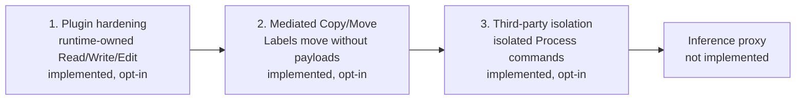

# Claude Code integration

The Claude Code package: its manifest, the starting policies, the harness
conformance check, and the install and uninstall instructions below. The
host-side code — the hooks, the status line, the runtime start, the
`appa` MCP registration and the `appa-guide` skill — is the `appa` binary
itself, the `appa-runtime` crate; its
[README](../../../appa-runtime/README.md) covers build, configuration, and
start.

How it works, in one paragraph: the install registers `appa hook` in the
user's Claude Code settings on every session event — prompt, tool call,
tool result, subagent start and finish. Each hook posts the event to the
runtime process and blocks a pending tool call if the runtime denies it or
`appa hook` exits with code 2. If Claude Code skips or times out a hook,
the call follows its normal permission flow. This covers actions at those hook boundaries, not
every observation or emission inside Claude Code; a root Stop event reports
turn completion rather than gating already-visible output. A subagent started
with the `Agent` tool runs
as a child of the session. The spawn is held until the session declares
what the subagent's final message may carry: as it is, floored at a
label, or through a sanitizer such as the schema attestation. The
subagent's own tool calls are checked the same way, and its final
message is checked when it stops. A stop whose message may not cross is
refused with the reason, or with the exact text to return when a
sanitizer rewrote it, and the subagent keeps running until it stops with
a message that crosses; the parent then receives that message unchanged.
A subagent definition that declares `maxTurns` blocks the session's
prompts: Claude Code ends such a subagent without the return check. The
project and user agent directories and the installed plugins are
scanned; agents passed on the command line are not.

## Security scope and implementation order

The goal is to enforce the guarantees available through a Claude Code plugin
and its bundled APPA runtime, then extend coverage through third-party isolation.
An inference proxy remains a documented future extension, outside the current
implementation sequence. Building a custom sandbox or modifying Claude Code
is not a goal.
Assume no process outside Claude Code edits workspace files. This does not
exclude subprocesses launched by Claude Code itself.



The three implemented stages are described in this README and in
[the file-mediation architecture note](../../../appa-runtime/FILE-MEDIATION.md), which
carries the component map, the call sequence, the ledger model and the boundary list.

### Plugin and bundled runtime

- Check proposals that reach `PreToolUse` before releasing the hooked call.
  Admit reported observations and execute remedies against the host-bound
  trajectory. Coverage depends on Claude invoking the corresponding hooks.
- Keep policy evaluation, Label combination, and trajectory state in the shared
  runtime. The plugin translates harness events; it does not define a separate
  file-Label algebra or persistence format.
- Runtime-owned file tools can check before content-dependent validation and
  admit results before returning them over MCP. The draft implements this path;
  normal plugin installation does not establish exclusive use of these tools.
- Refuse unsupported calls where a blocking hook is available. Such refusal
  does not cover work performed before the hook. Report missing coverage rather
  than claiming complete provenance for a partially observed trajectory.

Native Edit is a known boundary gap: a Claude Code 2.1.268 probe returned a
content-dependent match error before `PreToolUse`, with no APPA proposal.
The plugin cannot prevent that observation by denying the later hook. Native
Read/Write prevalidation coverage is not established. The constrained
`appa claude-files` launcher is an experimental test path, not proof that a
plugin installation disables native tools or implicit reads.

### Implementation sequence

1. **Sharpen the plugin without isolation or an inference proxy.** Integrate
   and test runtime-owned Read/Write/Edit through the installed bundle. Verify
   identity binding, failures, concurrent calls, interruption, and session-local
   state. Record native paths that remain unmediated. Tests must inspect actual
   file versions and observations, not just hook responses, and include live
   agentic exercises. An interrupted turn gives back the reservation of a call
   the harness never ran, while the workspace still matches the pin; a workspace
   that moved keeps it for the life of the runtime. Automatic reconciliation
   of a moved workspace is not implemented.
2. **Add mediated file-to-file Copy/Move.** File bytes need not enter model
   context for their Labels to propagate. Pin source and destination versions,
   retain the source's Label contribution, check the destination flow, and
   record the resulting version/path change. Treat returned acknowledgements
   and errors separately as trajectory observations. Initially support regular
   files within one managed workspace; refuse unsupported directory, link,
   and cross-filesystem cases. Test overwrite, identical bytes with different
   Labels, copy/move followed by Read, and interruption without losing Labels.
   This stage covers runtime-owned operations, not arbitrary Bash `cp` or `mv`.
3. **Integrate third-party isolation.** Evaluate agentsh or an equivalent
   backend for subprocess file, process, and network enforcement. Require
   verified capabilities and refuse execution on confinement setup failure.
   Start with enforced input/output boundaries and conservative combination of
   all accessible input Labels, rather than relying on audit events arriving
   before effects. Reuse the file-version and publication contracts from stage
   two. Test descendant processes, forbidden accesses, network attempts, and
   restart behavior before claiming coverage of shell `cp` and `mv`.

Copy/Move precedes isolation because its Label and publication contracts are
needed by either execution backend. Actual shell-command coverage still
depends on enforcing that commands use the isolated backend; recognizing a
command name does not establish mediation.

### Implemented file-to-file contract

The opt-in file runtime exposes `appa_copy_file(source_path, destination_path)`
and `appa_move_file(source_path, destination_path)` alongside Read/Write/Edit.
Both paths must be regular files or an absent destination within the managed
workspace. Move requires one filesystem. Both tools replace existing destination
content; its prior version remains in history but does not taint the new bytes.

The destination Label combines the source, receiving trajectory, and tool delta.
Policy requirements check that combined Label. Constant acknowledgements do not
carry the payload into the trajectory; reading the destination does. The ledger
pins both paths under one live reservation and records the source version as
a content dependency. Move also records source-path absence. An incomplete or
inconsistent outcome keeps the reservation and stops further file calls.

Live Claude Code exercises through the installed plugin verified Copy → Move →
acknowledgement-only Write without narrowing, then Read with narrowing and a
tainted summary. A second exercise verified overwrite and refusal of same-path
copy, missing-source move, and a move into `CLAUDE.md`. Unit tests cover raw bytes,
distinct Labels on identical bytes, source-path reuse, destination requirements,
incomplete transfers, and fresh-ledger behavior after restart. These tests establish the
mediated tool contract, not native-tool or arbitrary subprocess confinement.

### Isolated declared-input processing

The opt-in `appa_process_files(input_paths, output_path, command)` tool runs a
shell command on private input snapshots and publishes one regular output file.
The engine checks all input Labels before execution and applies their combination
to the output, stdout, stderr and failures. It records every declared dependency,
even when the command does not read that input.

The host-installed backend combines pinned, locally patched agentsh with bubblewrap
namespaces. Required helper setup failures refuse execution. The fixed syscall policy
denies sockets, keyrings and cross-process access; inherited descriptors and environment
are cleared. Input mounts are read-only. Publication waits for descendant teardown and
rejects symbolic/hard links or special files. Native Bash remains unsupported.

See [backend setup and contract](../../../integrations/agentsh/README.md) for requirements,
tests and limits. Live Claude tests cover a two-input invoice calculation, admitted failure
text, refused symlink publication and actual denied control-file/network/input-write
attempts. This confines supported subprocess calls, not Claude's native filesystem
access, inference traffic or final response.

### Running the opt-in file runtime

The file runtime is off unless the operator starts it that way:

```sh
appa runtime --config /host/file-policy.toml --db /host/runtime.db \
  --file-process-backend /host/backend
```

The `[file_tracking]` table in `file-policy.toml` enables file tracking and supplies the
initial trust and audience. Without that table, the runtime does not expose the file tools.
Each root session binds to the working directory in its first file call. Its subagents share
that workspace and in-memory ledger. Another root session can use another workspace on the
same runtime. The initial settings classify each root session's workspace snapshot. The runtime
hashes every file and refuses a workspace that holds a symlink or hard link anywhere in it.
Give it a dedicated directory rather than a working checkout. Keep the policy, runtime
database, and backend outside that directory.

The policy this runtime runs needs two things the shipped starting policy does not
have, so give the file runtime a policy of its own. The
[architecture note](../../../appa-runtime/FILE-MEDIATION.md#operating-it) includes a minimal
complete example.

- It must name all six file tools (`mcp/appa/appa_read_file`, `appa_write_file`,
  `appa_edit_file`, `appa_copy_file`, `appa_move_file`, `appa_process_files`); a tool
  the policy does not name is refused, not annotated.
- It must not use sanitizers or rewrite routes. File tracking refuses to start when the
  registry holds any, because a rewritten call would render arguments the ledger never
  pinned. The starting policy declares the Claude fallback annotator's sanitizers, so
  enabling file tracking against it stops at startup with that reason.

In file mode, APPA admits declared subagent spawns so children can use the root
session's ledger. Every other call that reaches APPA and is not one of the six file
tools is refused — including APPA's own management tools (`appa_get_runtime_state`,
`appa_include_battery`, `appa_match_batteries`, `appa_reload_policy`,
`appa_refresh_batteries`, `appa_update_policy`). Run those from the `appa` command
line. The model keeps its native tools, but their calls are refused at the hook.

One file operation runs at a time per root session. The root agent and its subagents share
the same in-memory ledger and reservation. Other root sessions have independent ledgers.
A released call the harness never ran gives its reservation back at the turn end, and only
while the workspace still shows the pinned state. A moved workspace keeps the reservation
for that session until the runtime restarts.

### Capabilities deferred to an inference proxy

For requests actually routed through it, a proxy could:

- Check context against the configured provider's permitted audience before
  forwarding a request, including retries and helper requests.
- Bind requests to the same trajectory as plugin events and account for
  resumed context, attachments, and compaction without resetting their Labels.
  Unclassified context must be refused or conservatively classified; an HTTP
  payload alone does not establish its provenance.
- Restrict provider-run features and admit their observations.
- Gate provider-generated text before forwarding response bytes to Claude,
  using the intended recipient and trajectory Label. This includes streaming,
  not only completed responses.

These capabilities are not implemented. A proxy does not undo a local
pre-hook observation or gate locally generated tool output, diagnostics, or
arbitrary subprocess traffic. Proxy coverage requires requests to use it;
preventing bypass connections requires separately verified network isolation.

### Non-goals and unclaimed coverage

- Building APPA's own OS sandbox or a modified Claude Code distribution.
- Complete native filesystem mediation until a backend has demonstrated
  interception of those paths, including pre-hook validation and implicit reads.
  Confining shell children alone does not establish coverage of the parent.
- Precise per-value dependencies inside arbitrary programs. Supported contracts
  may conservatively bound flows; shell parsing or a before/after directory diff
  cannot prove which inputs a process read.
- Protection outside the verified confinement boundary. Execution controls
  remain trusted host state; a private directory alone is not an OS access boundary.
- Metadata and timing-flow guarantees, or protection against outside writers.

Disabling or refusing a capability is a supported restriction, not evidence
that its internal flows are tracked. The plugin's guarantees must remain
explicit about the checked boundary and its unobserved inputs.

## What is here

- `appa-package.toml` — the package manifest: the starting policy and the
  `claude-code` battery a first install includes with it.
- `default.appa.toml` — a complete starting policy: the harness's other
  built-in tools released with the neutral annotation, web tool results
  marked suspicious, subagents run as children of the session, and a bounded
  per-call fallback for every tool the policy does not name. Bash, Read,
  Grep, Write and Edit are left to the battery, whose argument selectors a
  bare rule here would shadow.
- `live-gate-check.py` — the harness conformance check described below.

The `appa-guide` skill, which builds the initial tool policy and guides
later config changes, lives in `integrations/appa-guide/`; the install
writes it from the bytes compiled into the binary.

## Install

This flow needs the `claude` command, `curl`, and Cargo when building from a checkout.

`appa plugin install claude-code` installs one version: its packages and the
binary belonging to it. It selects the version, verifies every artifact
against that version's descriptor before anything outside a temporary file
changes, retains them under the deployment's `.appa/` state so a later
install needs no network, replaces the deployment's battery store
(`batteries/` beside the config) with that version's batteries, and activates
Claude Code
support with that version's own binary. What it installs does not depend on
the working directory.

A first install includes the `claude-code` battery, the one the plugin
requires, as one line of the config's include list
(`batteries/claude-code/appa.toml`). A later install leaves the include list
alone and warns when that battery is not among it. Every install then reads
the MCP servers Claude Code has configured, in its user scope and in the
current project's local and project scopes, and prints the batteries that
cover them as the commands that include them:

```text
MCP servers here have batteries; include them with:
  appa battery install github linear
MCP servers without a battery: fetch. Their tools are annotated call by call until `/appa-guide` writes rules for them.
Next: run `clappa`, then `/appa-guide` to check your MCP servers and tune the defaults.
```

Connectors from claude.ai and plugin servers are not in those files. In a
session, `appa describe --session-tools <names>` adds the servers the
session's tools belong to and matches them the same way; `/appa-guide` runs
it for you. `appa battery list` shows what is included;
`appa battery install <name>...` and `appa battery remove <name>` add and
remove lines.

A release binary installs the version published for its tag. The installer
verifies the checksum of the binary for Linux or macOS and places it in
`~/.local/bin` (Windows: unpack the zip from the releases page):

```sh
curl -fsSL https://openappa.com/install.sh | sh &&
  ~/.local/bin/appa plugin install claude-code
```

A checkout build has no published version, so it installs itself: the version
is the commit it was built from, exported from that checkout without the
network, and its binary is the one running the command.

```sh
cargo install --locked --path appa-runtime --force
appa plugin install claude-code
```

The install reports each slow phase on stderr. A first install at a terminal
asks one question, whether the agent may report its own blocked calls;
`--agent-yell` or `--no-agent-yell` answers it for a script. A runtime an
earlier APPA deployment of yours left at the runtime endpoint is stopped; an
unidentified listener or another user's process is named and never stopped.

The install puts `clappa` beside `appa` so the short command works in later
examples.

Activation deploys the `appa` binary to a private path under the data
directory and writes that exact path into every hook entry of the user's
Claude Code settings (`~/.claude/settings.json`), so a hook never resolves
`appa` through `PATH`. It registers the runtime's `appa` MCP server in Claude
Code's user scope, writes the `appa-guide` skill and its policy-review guide
under `~/.claude/skills/appa-guide/`, installs `clappa` with the settings
file that gives its sessions APPA's statusline, and starts the runtime through the deployed binary's own
start, the one every protected session performs at SessionStart. A first
install writes the starting policy; a later one keeps the file it finds. A
successful command therefore proves that one runtime from the installed
version is active. When an earlier APPA Claude plugin is still enabled, the
install disables it before adding the native hooks so each event is checked once.

An install owns only what names its deployed binary. Other hook entries, an
MCP server or a skill of your own are left alone; an `appa` MCP server or an
`appa-guide` skill that no install wrote stops the install before it writes
anything. Re-running the install rewrites what changed and is otherwise a
no-op, so two installs never stack two hook sets.

Linux binaries require glibc 2.34 or newer. Alpine and other musl-only
systems are not supported by the release assets.

The hook entries run the binary directly on every platform; on native Windows
the status line runs it through PowerShell.

### File locations

| System | Runtime | Policy | Database |
| --- | --- | --- | --- |
| Linux | `~/.local/share/appa/bin/appa runtime` | `~/.config/appa/appa.toml` | `~/.local/share/appa/` |
| macOS | `~/Library/Application Support/appa/bin/appa runtime` | `~/Library/Application Support/appa/appa.toml` | `~/Library/Application Support/appa/` |
| Windows | `%LOCALAPPDATA%\appa\bin\appa.exe runtime` | `%APPDATA%\appa\appa.toml` | `%LOCALAPPDATA%\appa\` |

The harness binary is APPA's own, not something you put on `PATH`: the hook
entries and `clappa`'s status line name that absolute path. `clappa` stays where a
shell can find it.

The runtime creates the starting policy only when the policy path does
not exist. It never replaces the policy or database.

Set `APPA_INSTALL_DIR`, `APPA_CONFIG_DIR`, or `APPA_DATA_DIR` in the
environment to change these locations; the install and the hooks follow them.

## Protect a Claude Code session

The hook entries run in every session but are inert until a session
opts in with `APPA_GATE=1`. Keep normal `claude` sessions unprotected
and use a separate `clappa` command for protected ones. The install creates
it as an executable beside the `appa` command — a PATH command works in
every open terminal with no shell reload, unlike an alias:

```sh
#!/bin/sh
exec env APPA_GATE=1 claude "$@"
```

When that directory is not on your `PATH`, use the alias form instead
and reload your shell: `alias clappa='APPA_GATE=1 claude'`. For native
Windows, add this function to your PowerShell profile:

```powershell
function clappa { $env:APPA_GATE = "1"; try { claude @args } finally { Remove-Item Env:APPA_GATE -ErrorAction SilentlyContinue } }
```

Only sessions started with `APPA_GATE=1` are protected. The binary reads
the variable from the Claude Code process environment, fixed at launch,
so a session cannot turn the protection off mid-session. A plain
`claude` session stays unprotected, and the binary prints nothing
into it. Protection belongs to the process, not the saved conversation:
resume a protected conversation with `clappa --resume`, not `claude --resume`.
Exit and restart a conversation already resumed through plain `claude`; it
cannot become protected in place.
The entries live in the user's settings: a project whose settings
set `disableAllHooks` turns them off for its sessions, and `clappa` cannot
protect a session there.

A protected session starts the installed runtime at SessionStart when
nothing healthy answers `/health` — normally a no-op, because the install
left it running — or replaces a runtime that answers `stale <pid>`,
which a running process does once an install replaced its binary on
disk. Blocking hooks refuse their actions while the runtime is unavailable. The starter
never installs software; rerun `appa plugin install claude-code` when the
binary is missing. There is no login service: a runtime
that dies mid-session blocks the session until the next session start
brings it back. Check the runtime with:

```sh
curl -sS -m 2 http://127.0.0.1:8787/health
```

The command must print `ok`. It prints `stale <pid>` when the binary
was installed again after this runtime started; the next protected
session start replaces the process.

The default policy names Claude Code's built-in tools and sends every other
tool through a bounded, fail-closed Claude annotator. That compatibility net
keeps a newly installed MCP tool usable, but it is not a substitute for a
reviewed connector contract. Start `clappa` and run `/appa-guide` from
that protected session. It inventories MCP servers, proposes exact policy
entries or maintained batteries, and marks which tools read data that must
stay in the session or send data outward. It asks once about servers it cannot
judge. You review the complete proposal before it writes anything. The same
skill explains a blocked call (`/appa-guide why was that blocked?`) and makes
the defaults stricter or looser on request.

For development from a source checkout, run the runtime on its own port
so an installed runtime on 8787 is untouched, and point a session at it
with `APPA_RUNTIME_URL` — the installed hook entries, the MCP server, and
the statusline all follow it:

```sh
cp marketplace/plugins/claude-code/default.appa.toml appa.toml
nohup cargo run --bin appa -- runtime --config appa.toml --db appa.db --listen 127.0.0.1:8788 >appa-runtime.log 2>&1 &
APPA_GATE=1 APPA_RUNTIME_URL=http://127.0.0.1:8788 claude
```

That runs the checkout's runtime behind the installed binary's hooks. To run
the checkout's hook client as well, install the build (`cargo install --locked --path
appa-runtime --force && appa plugin install claude-code`), or run
`live-gate-check.py`, which launches the harness with `--settings` entries
naming the built binary.

The start leaves a runtime at a URL of your own alone, stale or not, and
starts nothing there when nothing answers:
after a rebuild, restart it yourself. The last command is interactive and belongs to the user: a Claude
session performing this setup runs the first two and prints the third.

`APPA_RUNTIME_URL` is fixed at session launch, like `APPA_GATE`: a
running session cannot be pointed at a different runtime. To move
between the installed and the dev runtime, start a new session.

## Harness conformance check

`live-gate-check.py` runs two real headless `claude` sessions against a
runtime process it starts itself, under a policy that states one flow:
reading a file narrows its content to the session, and writing a file
releases content to the outside world. By default, Claude Code talks to a
deterministic local model fixture, so the check needs no Claude account and
consumes no model usage.

```sh
uv run marketplace/plugins/claude-code/live-gate-check.py
```

It launches the harness with `--settings` hook entries naming the appa
binary, the shape the install writes, and registers the runtime's MCP
server for the session. It judges the gate on what reached the disk and
the runtime's supported trajectory-status projection. One session writes
words of the model's own and the file lands. The other reads a private
file, narrows the trajectory to `session`, proposes the write, and that
line then appears in no file under any name. The allowed write is what
stops a runtime that is down from passing as a refusal: the hooks fail
closed, so a gate that is not answering blocks both sessions rather than
one.

The check does not depend on APPA's internal event-log encoding. It needs the
`claude` CLI on `PATH` and an appa binary: a local build, an installed one, or
`APPA_BIN`. Set `CLAUDE_BIN` to use a specific Claude Code binary.

Use the same scenarios as a small compatibility canary against the configured
Claude account:

```sh
uv run marketplace/plugins/claude-code/live-gate-check.py --model live
```

Only this explicit live mode consumes Claude usage.

## Upgrade

Rerun the installer (or `cargo install` from the new checkout), then rerun
`appa plugin install claude-code`. It replaces the deployed runtime and the
retained version together, and preserves policy and database files.

**Restart any running `clappa` session after an upgrade.** Claude loads a
session's hooks at session start, and the hook wire between the hooks and the
runtime carries no version, so a session running across an upgrade keeps
talking to the runtime it started with.

The install claims the runtime endpoint. A runtime an earlier deployment of
yours left there is stopped, whichever build or config it serves and whatever
`APPA_INSTALL_DIR` or `APPA_DATA_DIR` it ran under, and the install aborts
before touching Claude when that runtime will not stop. A process at the
endpoint that is not your own `appa` is named and never stopped. An `appa`
left at the old install path is never deleted; remove it when you are ready.

`appa runtime stop` stops the runtime on its own, under the same rule. A
runtime at `APPA_RUNTIME_URL` is yours and is left alone.

## Uninstall

```sh
appa plugin remove claude-code           # the Claude Code profile only
appa plugin remove claude-code --purge   # also stop the runtime and delete the deployment
rm -f ~/.local/bin/appa
cargo uninstall appa   # checkout builds only
```

`appa plugin remove claude-code` takes back only what an install wrote: its
hook entries, the `appa` MCP server, the skill, `clappa`, and `clappa`'s
settings file. A hook entry or skill of your own survives untouched.
The policy, database, and runtime stay at the locations in the table above.

`--purge` goes on to stop the runtime and delete both directories in the
table: the deployed binary, database, logs, retained versions, policy, and
install state. It reads none of the install state, so it is the way out of
a deployment an install refuses. `appa` on PATH stays, so the next
`appa plugin install claude-code` starts from nothing. Remove a `clappa`
shell alias separately if you added one instead of the command.

## Statusline and SendMessage

`clappa` starts Claude Code with `--settings <data dir>/clappa.settings.json`.
That file holds two settings, so they apply to `clappa` sessions only, above
your own. A plain `claude` session keeps yours, and the install never edits
them.

- APPA's `statusLine`.
- `permissions.deny: ["SendMessage"]`. A message to another session leaves
  this trajectory without its label. The agent starts a subagent with `Agent`
  instead, and the runtime checks that subagent's final message.

The status line shows the APPA pixel mascot plus the session's current Trust
and Audience, read from the runtime's `GET /status`. It fails open: runtime
down, unknown trajectory, or malformed input prints the mascot alone, never a
blocked action.

## Things to know

- **An edited policy installs without a restart.** `curl -X POST
  http://127.0.0.1:8787/reload` re-reads the `--config` file. The
  runtime validates before it installs, so a bad file answers 422 and
  changes nothing. Sessions started after the reload bind the new
  policy; sessions already running keep the file they opened with.
- **Stopping the process blocks protected sessions.** That is the
  design, not a fault. Start a plain `claude` if you want an
  unprotected session.
- **The integration adds roughly zero tokens to a session.** The protection
  is hooks and an MCP server, not prompt text.
